# UnityZombies

A high graphics, next gen FPS zombie survival game I'm creating using the Unity engine, GIMP, Vegas and other tools, based on the classic Nazi Zombie series, with realistic, attention to detail animations, high quality weapons and 3D sounds. (Weapon, Tree, House, FBX, prefabs preprovided by unitypackages without decent animations / scripts. I have created every animation and script).

dev v1.0  
added house prefabs   
added first player controller and WASD movement, mouse look movement, jumping  
added light, made scene pitch black  
added grass to the plane  
added ACR prefab, added a custom skin  
created animations for ACR firing, ADS, walking, reloading, jumping, shooting whilst ADS, drawing  
added sounds to the animations  
coded animations with correct keybindings  
added crouching feature  
added raycast and bullet hole feature  
finetuned ACR animation times and smoothened animations  
fixed ACR animation bugs and logic errors  

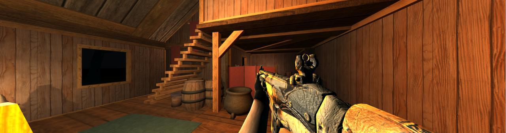
  
dev v1.0.1  
added zombie prefab and added walking animation  
fixed walking animation resetting and zombie not dying when idle  
created zombie spawn point  
added navmesh and zombie pathfinding  
added blood particle effect when bullet hits zombie  
implemented basic zombie hp system  
added zombie dying animation and coded it in  
  
dev v1.0.2  
fixed zombie mesh not disappearing upon death (created separate mesh object)  
coded in 15 different zombie dying and hit sounds  
  
dev v1.0.3  
added M24 prefab  
created and coded animations for M24 firing, ADS, reloading  
added sniper scope animations and on screen crosshairs  
fixed thread times and fine tuned animations in time with raycasts  
added reloading whilst looking through scope animation  
added sounds to the animations  

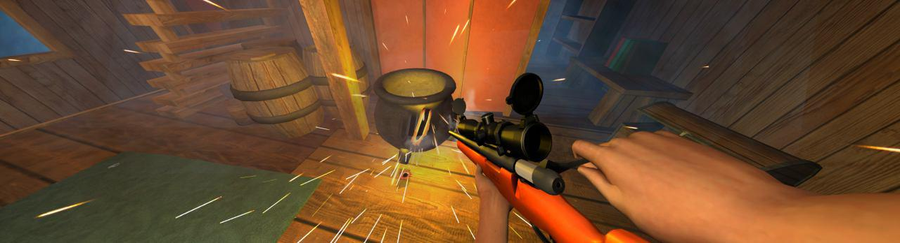
  
dev v1.1  
changed skybox  
added trees  
added lightning, wind, rain and fog  
fixed frame rate issues  
made foliage move in the breeze  
added more zombie spawn points  

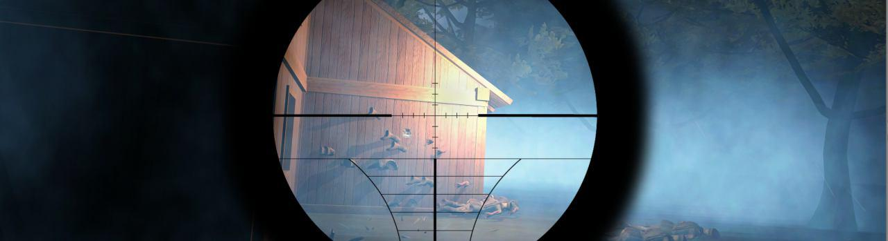
  
dev v1.1.1  
added wall guns  
coded wall gun player sensor and weapon pickup controls  
added text alert to the GUI when player is on the sensor  
added weapon switching and a weapon manager  
fixed being able to draw 2 weapons at once  
fixed all weapon booleans being stuck in erroneus states when switching weapons  
configured mystery box prefab  
added 3D spatial blend to all sounds and adjusted zombie dying sounds rolloff  

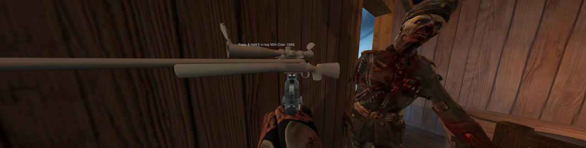
  
dev v1.1.2  
added colt prefab and added custom texture  
created and coded colt ADS, shooting whilst ADS, reloading, draw, firing animations  
added colt reloading, ADS  
added new bullet hole system (10 different bullet holes and animations based on surface, tagged all game objects with respective tags)  
added muzzle flash and smoke  
added weapon bullet hole flying and impact sounds with 3D spatial blend  
added 3D spatial  blend to all weapon sounds  
fixed shooting whilst reloading issue on colt  
fixed player moving with mouse pan  
fixed shooting whilst rapid pressing r on all weapons  
added distortion and screen shaking when firing colt ADS  
improved m24 and colt ADS animations by animating camera as well as weapon  

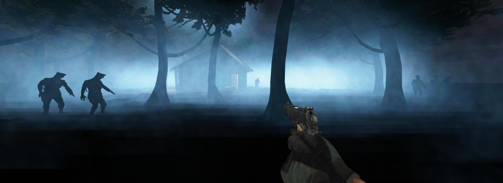
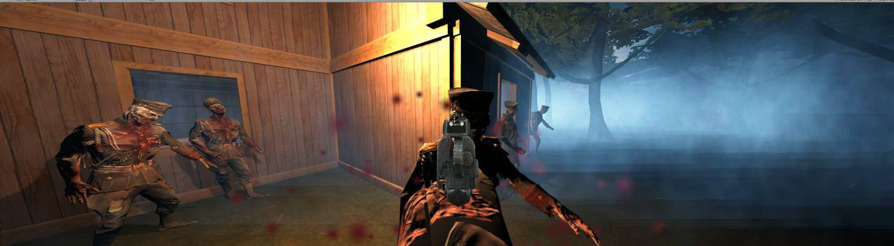
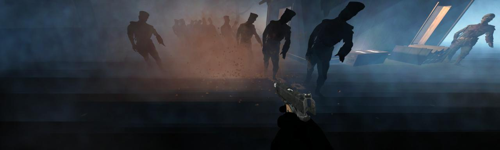

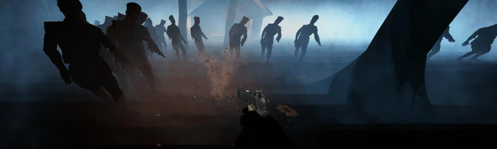
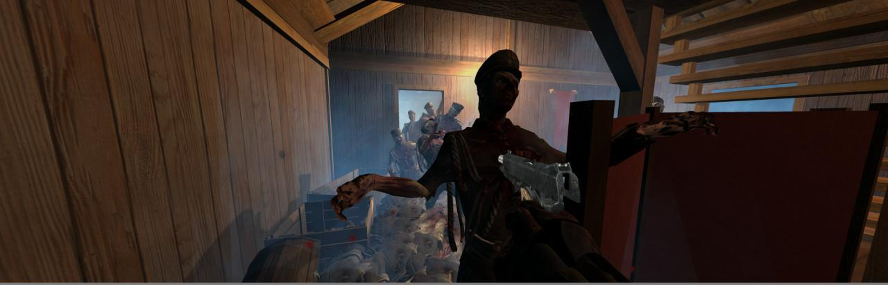
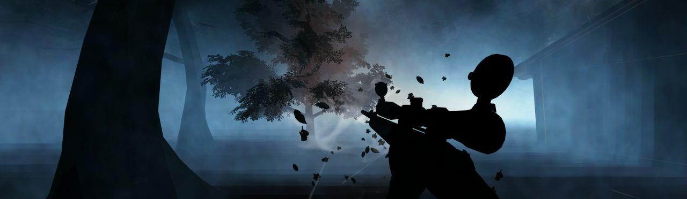
  
dev v1.1.3  
  
added barrier prefab  
created window barrier animation  
created and programmed sensor for zombie and player near window  
added text alert to the GUI when player is on the sensor and fixed issue with it not going away  
added fix board animations and a single remove board animation  
fixed various bugs with animations not working and zombies not coming into the window once all the boards have been knocked down  
fixed zombies standing on ledge whilst taking down boards  
added sounds to tbe boards being taken down with 3D spatial blend and adjusted rolloff  
adjusted rolloff for zombie gib sounds  
fixed remove board animation not working and finetuned timings  
fixed rebuild barrier alert not going away when barrier is built  
added bullet hole information to the boards and retextured them  
added more remove board animations  
cloned another barrier into the scene for the other window  
Spawnwall -> hit.transform.parent.gameObject means all windows can be managed dynamically with the same script  
created more space in the house, removed some objects  
removed mesh renderer from window quad  
replaced object message system using direct variable accesses, reduced code clutter  
fix barrier animation repeating  
fix barrier board not coming back  
added delay to rebuilding barrier  
added souds to rebuilding the barrier with correct rolloffs and 3D spatial blend  
separated ACR aim and sway animations to camera and gun to allow for both animations at the same time, adds realistic sway when ADS  
fixed ACR raycast, made child of gun  
fixed ACR shooting whilst reloading logic error  
adjusted lighting and effects  
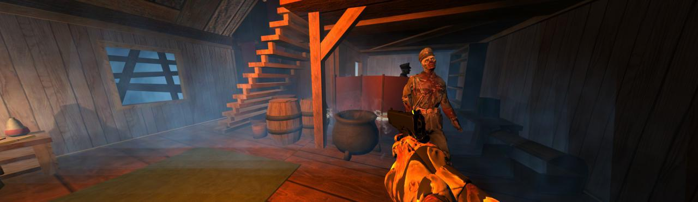
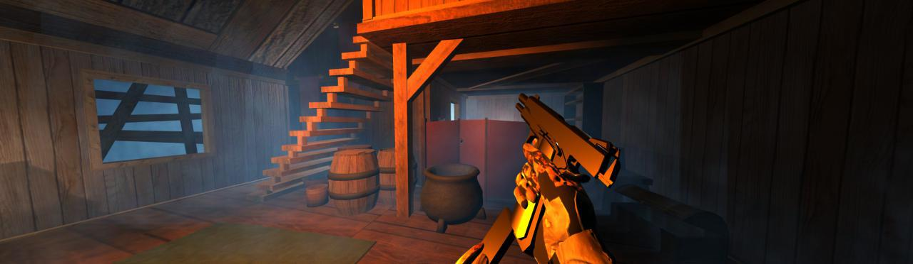
