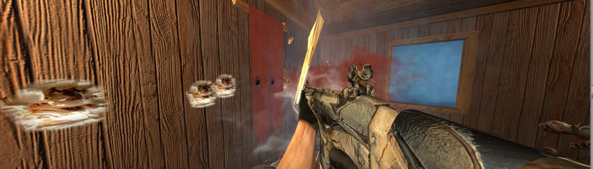

# UnityZombies

A high graphics, next gen FPS zombie survival game I'm creating using the Unity engine, GIMP, Vegas and other tools, based on the classic Nazi Zombie series, with realistic, attention to detail animations and high quality weapons. (Weapon, Tree and House prefabs preprovided by unitypackages without animation or decent scripts)

